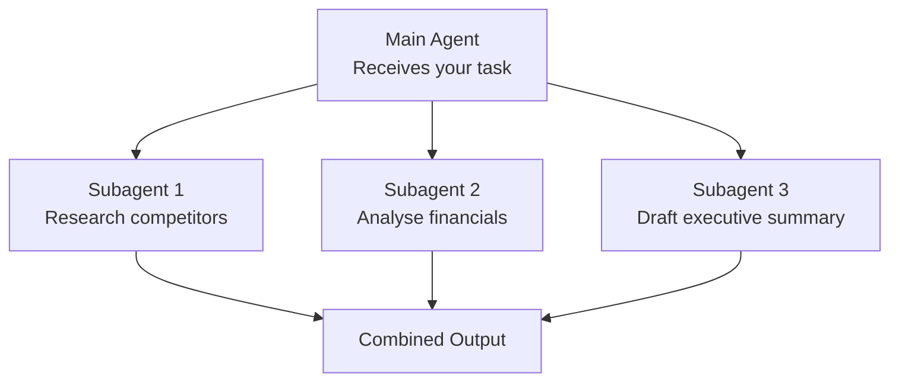

# Subagents

When one AI agent isn't enough, it can spawn more to work in parallel.

## How Subagents Work



1. You give one complex task
2. The main agent breaks it into pieces
3. Each piece goes to a subagent
4. They work simultaneously
5. Results come back and get combined

## Why This Matters

**Speed**
Multiple research threads run at once. What would take one agent an hour takes the team minutes.

**Thoroughness**
Different angles explored simultaneously. Nothing waiting in a queue.

**Specialisation**
Each subagent can focus on its piece. The main agent handles coordination.

## Good Use Cases

**Research tasks**
Research competitors, analyse the market, review academic literature — all at once.

**Multi-faceted analysis**
Financial analysis, operational review, customer feedback — parallel streams.

**Content creation**
Research, outlining, drafting different sections — simultaneous.

**Complex reports**
Each section tackled by a different subagent, main agent assembles.

```callout
type: info
title: "Behind the Scenes"
content: "You don't usually need to manage subagents directly. The main agent decides when to parallelise and handles coordination. You just see the task complete faster."
```

## The Mental Model

Think of it like this:
- **Without subagents**: One person doing everything sequentially
- **With subagents**: A team tackling different aspects simultaneously

You delegate to one "manager" agent. It staffs the project appropriately.

```quiz
id: subagents-benefit
type: multiple-choice
question: "What's the primary benefit of AI using subagents?"
options:
  - "Subagents are more accurate than single agents"
  - "Complex tasks get tackled in parallel, completing faster and more thoroughly"
  - "Subagents are cheaper to run"
  - "Subagents have access to more tools"
answer: 1
explanation: "Subagents allow parallel work — multiple aspects of a complex task being tackled simultaneously. This means faster completion and more thorough coverage than sequential single-agent work."
```
