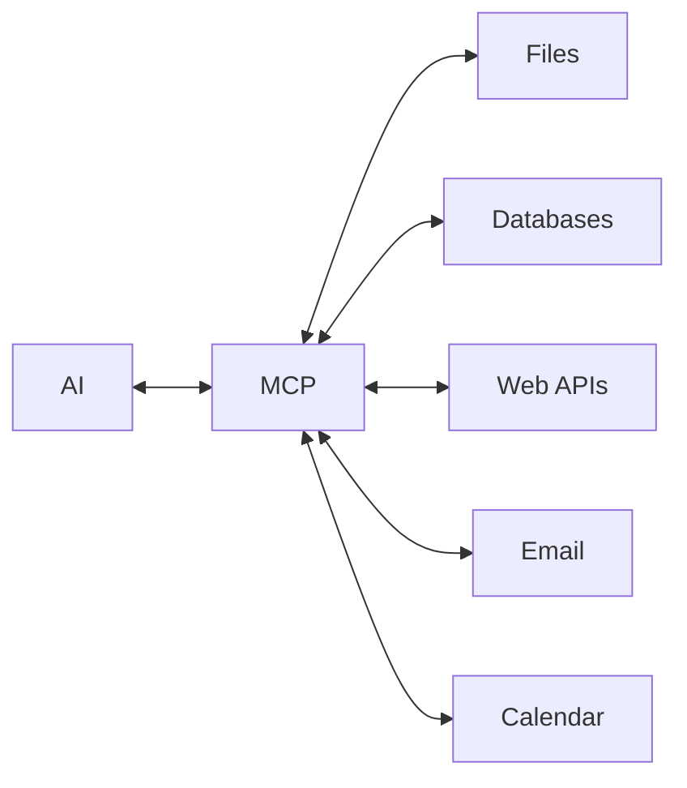

# MCP: Connecting AI to Your Tools

The Model Context Protocol — think of it as "USB-C for AI."

## The Problem

Without connections to your systems:
- Copy data into AI
- AI processes it
- Copy results back out

Manual. Tedious. Error-prone.

## The Solution

MCP provides a standard way for AI to connect to your tools and systems directly.



AI reads from your systems. AI writes back directly. No manual copying.

## What MCP Enables

**File system access**
AI reads and writes files directly in specified folders.

**Database queries**
AI can query databases and work with the results.

**API interactions**
AI calls web services, retrieves data, posts updates.

**Application integration**
Email, calendar, project management tools — AI interacts directly.

## Before and After

**Without MCP:**
1. Export data from your system
2. Upload to AI
3. Get AI's output
4. Manually enter results back into your system

**With MCP:**
1. Ask AI to do the task
2. AI reads from the system, processes, writes back
3. Done

```callout
type: note
title: "Evolving Standard"
content: "MCP is still developing. Available integrations vary by platform. But the direction is clear: AI that doesn't just produce documents, but takes actions in your systems."
```

## Practical Examples

**Email integration**
"Summarise my unread emails and draft replies to anything urgent."
AI reads email, processes, drafts responses.

**Calendar integration**
"Find time for a 1-hour meeting with Sarah next week."
AI checks both calendars, suggests slots.

**Database integration**
"Get last month's sales figures and create a summary report."
AI queries database, generates report.

## Security Considerations

MCP connections need appropriate permissions:
- What can AI read?
- What can AI write?
- What actions can AI take?

Thoughtful setup prevents AI from accessing or modifying things it shouldn't.

```quiz
id: mcp-purpose
type: multiple-choice
question: "What does MCP (Model Context Protocol) enable?"
options:
  - "Faster AI processing speed"
  - "Better language understanding"
  - "Direct AI connections to your tools and systems"
  - "Lower AI costs"
answer: 2
explanation: "MCP provides a standard way for AI to connect to external systems — files, databases, APIs, applications. This enables AI to read from and write to your systems directly, rather than requiring manual copy-paste."
```
