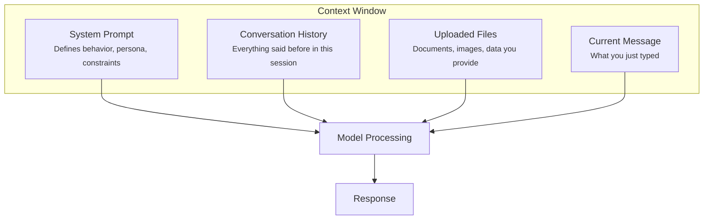

# What Is the Context Window?

The context window is the model's "working memory." It's everything the model can see when generating a response.



## Context Window Sizes

Context windows have grown dramatically over time:

| Era | Size | Equivalent |
|-----|------|------------|
| GPT-3 (2020) | ~4K tokens | ~3,000 words |
| GPT-4 (initial) | ~8K tokens | ~6,000 words |
| Claude 2 (2023) | ~100K tokens | ~75,000 words |
| Current (2025) | ~200K tokens | ~150,000 words |

**200K tokens is roughly 150,000 words — about 500 pages of text.**

```callout
type: info
title: "What's a Token?"
content: "Tokens are chunks of text the model processes. Roughly 1 token = 0.75 words, or about 4 characters in English. 'Hello' is 1 token. 'Understanding' is 2 tokens."
```

## The Shift in Constraints

This growth changes everything.

**Old constraint:** What fits in context? (Very limited. Had to be selective.)

**New constraint:** What's relevant? (Can fit entire books, but relevance still matters.)

You can now fit:
- Complete codebases
- Full documentation sets
- Entire books
- Hours of conversation history

But more isn't always better. The model still needs to find what's relevant in all that context.

## What Goes Where

Not all context is equal. Here's what typically fills the window:

**System Prompt** (usually invisible to you)
- Set by the application you're using
- Defines personality, capabilities, constraints
- Why Claude on claude.ai behaves differently than Claude in a custom app

**Conversation History**
- Everything you and the model have exchanged
- Grows with each message
- Provides continuity but can also clutter

**Files and Documents**
- PDFs, code files, images, data
- Explicitly provided by you
- Most direct way to give grounded information

**Your Current Message**
- What you just typed
- Your immediate instruction or question

```quiz
id: context-window-understanding
type: multiple-choice
question: "Why have larger context windows changed how we work with AI?"
options:
  - "They make the model smarter"
  - "They shift the constraint from 'what fits' to 'what's relevant'"
  - "They eliminate the need for good prompts"
  - "They allow the model to access the internet"
answer: 1
explanation: "Larger context windows mean we can now include much more information, but the challenge shifts to ensuring what we include is relevant and well-organized."
```
