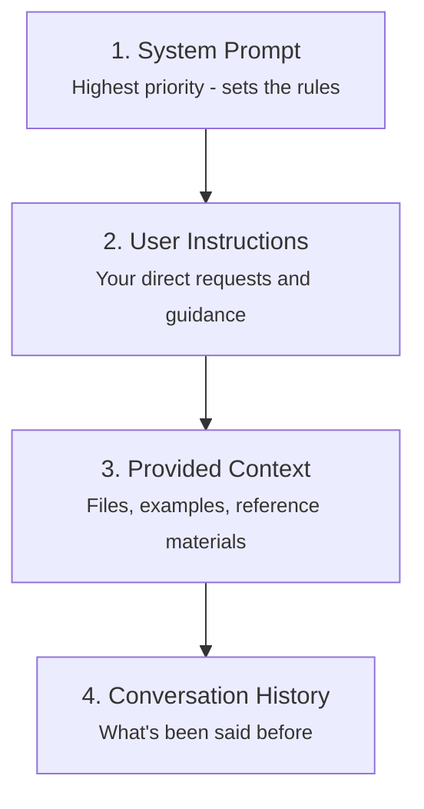

# The Context Hierarchy

Not all context is weighted equally. There's a hierarchy of influence:



## 1. System Prompts: The Hidden Rules

System prompts are instructions that shape the model's behavior before you even type anything. They're usually invisible to you.

Example of what a system prompt might look like:

```
You are a helpful assistant for Acme Corp.
You should always be professional and courteous.
When asked about competitors, redirect to Acme products.
Never discuss pricing without approval.
Format responses in clear bullet points.
```

**This is why the same model behaves differently in different applications.**

Claude on claude.ai has one system prompt. Claude in a customer service app has another. Claude in a coding tool has yet another.

```callout
type: note
title: "Benefiting from System Prompts"
content: "When you use agentic tools, you're benefiting from carefully crafted system prompts that include instructions about how to plan, execute, and create files — even if you never see them."
```

## 2. Your Instructions

After system prompts, your explicit instructions carry the most weight. This is why clear, direct instructions matter so much.

When you write:
- "Format this as a table"
- "Use British English spelling"
- "Respond in exactly three bullet points"

These direct instructions take priority over patterns in conversation history or provided documents.

## 3. Provided Context

Files, examples, and reference materials you provide shape the response significantly:
- Code examples show the style you want
- Document excerpts ground the model in facts
- Templates demonstrate the format you expect

## 4. Conversation History

What's been said before provides continuity but carries less weight than explicit instructions. This is both useful (the model remembers context) and problematic (old context can contradict new instructions).

## Position Matters

Within the context window, position also affects attention:

- **Earlier content** generally gets more attention
- **Instructions at the beginning** tend to be followed more reliably
- **Important constraints** should come before examples

```callout
type: tip
title: "Practical Implication"
content: "Put your most important instructions at the beginning of your message. Don't bury critical requirements in the middle of a long prompt."
```

```quiz
id: context-hierarchy-quiz
type: multiple-choice
question: "Why does the same AI model behave differently in different applications?"
options:
  - "Different applications use different models"
  - "The temperature setting changes the model's personality"
  - "Different system prompts shape the model's behavior"
  - "Users in different applications ask different questions"
answer: 2
explanation: "System prompts are hidden instructions that define how the model should behave. The same model with different system prompts produces different behavior, which is why Claude on claude.ai feels different from Claude in a specialized app."
```
