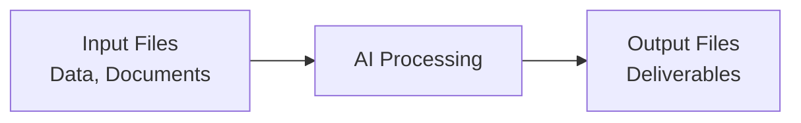

# The Paradigm Shift

This is where we shift from thinking about AI as chat to thinking about AI as a tool that produces deliverables.

## Old Way vs New Way

**Old way: Chat workflow**
1. Chat with AI
2. Copy the text from the response
3. Paste it into a document
4. Format it
5. Fix issues
6. Repeat

**New way: File workflow**
1. Give AI input files
2. Receive output files
3. Done

```callout
type: tip
title: "The Key Distinction"
content: "Chat is for communication — clarifying what you need, reviewing progress. Files are for actual work — documents, spreadsheets, presentations, code, analysis."
```

## Why This Changes Everything

When you think in files instead of chat:

**You work with real deliverables**
Not text you have to assemble into something useful.

**You maintain proper formatting**
Excel formulas work. PowerPoints present. Code runs.

**You can iterate properly**
Edit the actual document, not restart the chat.

**You produce professional output**
Files look professional. Chat exports don't.



## The Practical Implication

If you're copy-pasting from chat into Word, Excel, or PowerPoint — you're doing it wrong.

You should be receiving the file directly. Ask for the file format you need, and AI will create it.

```quiz
id: files-paradigm
type: multiple-choice
question: "What's the key difference between chat-based and file-based AI workflows?"
options:
  - "File-based workflows are slower but higher quality"
  - "Chat workflows produce text; file workflows produce usable deliverables"
  - "File workflows only work with certain AI models"
  - "Chat is better for complex tasks"
answer: 1
explanation: "The fundamental shift is from receiving chat text (that you then copy-paste and format) to receiving actual files (documents, spreadsheets, presentations) that are ready to use or edit directly."
```
