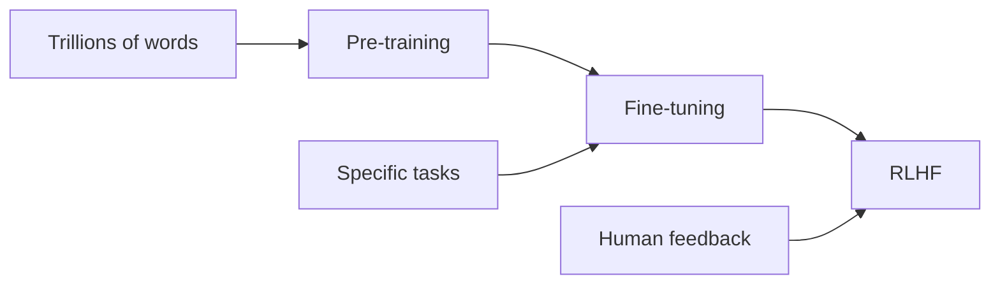

# How LLMs Get Trained

How do these models get trained? Three main phases.



## Phase 1: Pre-training

**What happens:** The model ingests trillions of words from the internet, books, code, everything.

**What it learns:** The patterns of language. This is where the "knowledge" comes from — or more accurately, where it learns what text about topics looks like.

Think of it as: Reading the internet and learning how language works.

## Phase 2: Fine-tuning

**What happens:** The model is trained specifically on instruction-following. Question-answer pairs, task completions.

**What it learns:** How to follow instructions. This is why Claude responds to questions instead of just continuing your text.

Think of it as: Learning to be helpful rather than just completing text.

## Phase 3: RLHF (Reinforcement Learning from Human Feedback)

**What happens:** Humans rate responses. The model learns what humans find helpful, accurate, and appropriate.

**What it learns:** What "good" responses look like according to human preferences.

Think of it as: Learning to be genuinely useful, not just technically correct.

```callout
type: note
title: "Why This Matters"
content: "Each phase shapes the model's behavior. Understanding this helps you understand why models behave the way they do — and why they sometimes surprise you."
```

## The Knowledge Cutoff

Important: The model's "knowledge" comes from pre-training data. It has a cutoff date — it doesn't know about events after that date unless you tell it.

This is why providing current context matters so much. The model isn't searching the internet. It's working from patterns learned during training, plus whatever you provide in the conversation.

```quiz
id: llms-training-phases
type: multiple-choice
question: "What is the purpose of RLHF (Reinforcement Learning from Human Feedback) in LLM training?"
options:
  - "To make the model faster"
  - "To teach the model to write code"
  - "To align the model's responses with human preferences for helpfulness"
  - "To reduce the model's memory usage"
answer: 2
explanation: "RLHF is the phase where humans rate responses, teaching the model what humans find helpful, accurate, and appropriate. It aligns the model's behavior with human preferences."
```
