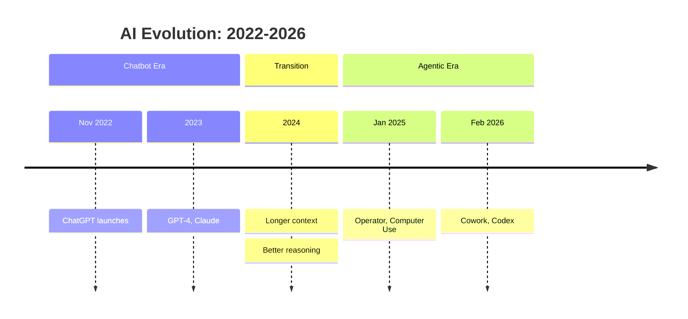

# This Moment Is Different

Welcome to this training. This is not about AI hype. This is about a fundamental shift in how work gets done.

If you came here thinking this is about chatbots — asking ChatGPT questions — you're in for a surprise.

**We're not talking about chatbots anymore. We're talking about AI that does work.**

In the last 8 weeks, something fundamental has changed. AI has crossed a threshold from "assistant that answers questions" to "worker that completes tasks." That distinction matters.

## What's Changed

Let's be specific about what's different now.

**8 Weeks Ago:**
- Chat-based Q&A
- Copy-paste from responses
- Constant back-and-forth
- "AI can help with..."

**Now:**
- File-based deliverables
- Delegate and receive
- AI plans, executes, delivers
- "AI does this work"

Eight weeks ago, you'd ask AI questions, copy the answers, paste them somewhere, ask more questions. Constant hand-holding.

Now? You delegate a task. AI plans it, executes it, creates the actual files. You come back to finished work.

Cowork, Codex, Claude Code — these aren't chatbots. They're workers. That's a completely different relationship with the technology.

```callout
type: info
title: "The Inflection Point"
content: "We're at the beginning of AI that doesn't just answer questions — it does work. And most people haven't caught up yet. That's your opportunity."
```

## The AI Timeline

Here's how we got here:



- **November 2022** — ChatGPT. The chatbot era begins.
- **2023–2024** — Getting better, but still fundamentally chat-based. You ask, it answers.
- **January 2025** — First glimpses of agents. AI that can take actions.
- **February 2026** — Now. Cowork launches. Codex ships. This is the inflection point.
