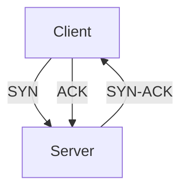

# Training App — Architecture Plan

## Overview

A server-side rendered training/learning application built in Go using the Gotea (go-tea) framework. Training content is authored as markdown files with custom fenced code blocks for interactive elements. The Gotea server parses, orchestrates, and renders all content, keeping learner state and assessment logic entirely server-side.

### Core Principle

**Markdown as the single source of truth.** All training content — narrative text, diagrams, quizzes, exercises, annotations — is specified declaratively in markdown files. The application layer is a smart renderer and orchestrator that interprets this content and delivers a rich interactive experience.

### Why Gotea

Gotea's architecture maps naturally onto the training app problem:

- **Server-side state**: Learner progress, quiz answers, and assessment scores live on the server. Nothing can be inspected or cheated via browser dev tools.
- **Message-driven interactions**: Every learner action (answering a quiz, navigating pages, completing an exercise) is a TEA message. No REST endpoints to design per interaction type.
- **Automatic re-rendering**: State changes trigger a full re-render via morphdom. The UI always reflects current state without manual DOM manipulation.
- **Broadcasting**: Instructor-led sessions become trivial — an instructor session mutates shared state and calls `app.Broadcast()` to push updates to all connected learners.
- **Session isolation**: Each WebSocket connection gets its own state instance, so per-learner progress tracking is built into the model.

---

## Content Authoring Format

### Directory Structure

```
content/
├── course.yaml                    # Global course metadata and module ordering
├── module-networking/
│   ├── _module.yaml               # Module metadata: title, prerequisites, difficulty, roles
│   ├── 01-intro.md
│   ├── 02-tcp-ip-fundamentals.md
│   ├── 03-dns-deep-dive.md
│   └── 04-assessment.md
├── module-security/
│   ├── _module.yaml
│   ├── 01-threat-models.md
│   └── ...
└── shared-assets/
    ├── diagrams/
    └── images/
```

### Frontmatter

Each markdown file supports YAML frontmatter for page-level metadata:

```yaml
---
title: "TCP/IP Fundamentals"
duration: 15m
tags: [networking, protocols]
notes: "Instructor should demo Wireshark capture here"
---
```

Module-level metadata lives in `_module.yaml`:

```yaml
title: "Networking Fundamentals"
description: "Core networking concepts for engineers"
prerequisites:
  - module-intro
difficulty: intermediate
roles: [developer, sre, architect]
estimated_duration: 2h
```

### Standard Markdown

All standard markdown features are supported via Goldmark and rendered to HTML:

- Headings, paragraphs, emphasis, links
- Fenced code blocks with syntax highlighting (via Chroma)
- Tables
- Images (relative paths resolved from content directory)
- Blockquotes
- Horizontal rules

This narrative content is rendered by Goldmark and embedded into the Gotea element tree via `h.UnsafeRaw()`.

### Custom Interactive Blocks

Custom fenced code blocks define interactive elements. Goldmark extensions extract these as structured Go data at parse time. Gotea render functions then build live `h.Element` trees with proper message handlers.

#### Quiz Block

````markdown
```quiz
id: tcp-handshake-q1
type: multiple-choice
question: "What is the correct order of a TCP three-way handshake?"
options:
  - "SYN, SYN-ACK, ACK"
  - "ACK, SYN, SYN-ACK"
  - "SYN, ACK, SYN-ACK"
  - "SYN-ACK, SYN, ACK"
answer: 0
explanation: "The client sends SYN, the server responds with SYN-ACK, and the client completes with ACK."
```
````

Supported quiz types:

- `multiple-choice` — single correct answer from options
- `multi-select` — multiple correct answers (answer is a list of indices)
- `true-false` — boolean question
- `ordering` — drag-to-reorder (answer is the correct sequence)
- `free-text` — open-ended with optional regex/keyword validation

#### Mermaid Diagram Block

````markdown

````

Rendered client-side by Mermaid.js. The Gotea extension emits a `<div class="mermaid">` containing the raw source. A small script initialises Mermaid after morphdom patches.

#### KaTeX Math Block

````markdown
```math
E = mc^2
```
````

Inline math also supported: `$\sum_{i=1}^{n} x_i$`

Rendered client-side by KaTeX.js, same pattern as Mermaid.

#### Annotated Image Block

````markdown
```annotated-image
src: ./diagrams/network-topology.png
alt: "Corporate network topology"
hotspots:
  - x: 30%
    y: 45%
    label: "Load Balancer"
    detail: "HAProxy distributing traffic across application servers."
  - x: 70%
    y: 60%
    label: "Cache Layer"
    detail: "Redis cluster for session storage and query caching."
```
````

Rendered as an image with interactive overlay hotspots. Clicking a hotspot expands the detail text. All interaction is Gotea messages — clicking sends a `HOTSPOT_TOGGLE` message, the server updates which hotspot is active, and re-renders.

#### Terminal Replay Block

````markdown
```terminal-replay
src: ./recordings/kubectl-demo.cast
title: "Deploying to Kubernetes"
autoplay: false
speed: 1.5
```
````

Embeds an asciinema player. The `.cast` file is served as a static asset. This is one of the few purely client-side rendered blocks.

#### Code Exercise Block

````markdown
```exercise
id: write-http-handler
language: go
prompt: "Write an HTTP handler that returns a JSON response with a 'status' field set to 'ok'."
starter: |
  func healthHandler(w http.ResponseWriter, r *http.Request) {
      // Your code here
  }
validation:
  type: output-match
  expected: '{"status":"ok"}'
```
````

The learner types code in an editor widget. Submission sends the code as a message to the server. Validation strategy depends on `type` — `output-match` runs the code (sandboxed) and compares output; `contains-keywords` checks for required patterns; `manual` flags for instructor review. Code execution is a later-phase feature — initial versions can use keyword matching.

#### Callout/Admonition Block

````markdown
```callout
type: warning
title: "Security Consideration"
content: "Never store plaintext passwords. Always use bcrypt or argon2 for hashing."
```
````

Types: `info`, `warning`, `tip`, `danger`, `note`. Rendered as styled boxes with appropriate icons.

---

## Parsing Pipeline

### Startup Sequence

1. **Walk content directory** — Discover all modules and their markdown files.
2. **Parse module metadata** — Read `_module.yaml` for each module.
3. **Build course graph** — Resolve prerequisites into a directed acyclic graph. Validate no circular dependencies.
4. **Parse each markdown file:**
   a. Extract YAML frontmatter → `PageMeta` struct.
   b. Run Goldmark with custom extensions.
   c. Custom extensions intercept fenced blocks, extract structured data into Go structs, and replace the block in the HTML output with a numbered placeholder marker: `<div data-block-index="N"></div>`.
   d. Store the rendered HTML and extracted `[]Block` together as a `Page`.

### Goldmark Extension Architecture

Each custom block type is implemented as a Goldmark extension with two parts:

- **Parser**: Recognises the fenced code block by its language tag (e.g., `quiz`). Parses the YAML content into a Go struct. Adds a custom AST node.
- **Renderer**: Emits the placeholder `<div data-block-index="N">` marker into the HTML output. The actual interactive rendering is handled by Gotea at render time.

The extension registers the parsed block data on a collector that the calling code can retrieve after parsing completes:

```go
type ParseResult struct {
    HTML   []byte
    Blocks []Block
}

type Block interface {
    BlockType() string
}

// Concrete types: QuizBlock, MermaidBlock, AnnotatedImageBlock, etc.
```

### Hot Reloading (Development)

In development mode, the server watches the content directory with `fsnotify`. On file change, it re-parses the affected module and rebuilds the course graph. Connected sessions get a re-render automatically (morphdom handles the diff). No restart needed.

---

## Application Model

### State Structure

```go
type Model struct {
    gt.Router

    // --- Loaded at startup, shared across sessions (read-only) ---
    Course  *CourseGraph
    Modules map[string]*Module

    // --- Per-session learner state ---
    LearnerID     uuid.UUID
    CurrentModule string
    CurrentPage   int
    Progress      map[string]*ModuleProgress
    ActiveQuiz    *QuizState
    ActiveHotspot string  // ID of currently expanded hotspot
    Preferences   LearnerPreferences
}

type CourseGraph struct {
    ModuleOrder   []string                    // Canonical ordering
    Prerequisites map[string][]string         // module -> required modules
}

type Module struct {
    Meta  ModuleMeta
    Pages []Page
}

type Page struct {
    Meta          PageMeta
    NarrativeHTML []byte
    Blocks        []Block
}

type ModuleProgress struct {
    Started       bool
    CurrentPage   int
    QuizScores    map[string]QuizScore   // quiz ID -> score
    CompletedAt   *time.Time
}

type QuizState struct {
    QuizID    string
    ChosenIdx int   // or []int for multi-select
    Answered  bool
    Correct   bool
}

type LearnerPreferences struct {
    FontSize    string  // "small", "medium", "large"
    Theme       string  // "light", "dark"
}
```

### Init

```go
func (m *Model) Init(sid uuid.UUID) gt.State {
    model := &Model{
        LearnerID: sid,
        Course:    globalCourse,     // Shared reference
        Modules:   globalModules,    // Shared reference
        Progress:  make(map[string]*ModuleProgress),
    }

    // Set starting module to first in course order
    model.CurrentModule = model.Course.ModuleOrder[0]
    model.CurrentPage = 0

    // Register routes
    model.Register("/", model.renderCurrentPage)
    model.Register("/module", model.renderModuleSelector)
    model.Register("/progress", model.renderProgressDashboard)

    return model
}
```

### Message Map

```go
func (m *Model) Update() gt.MessageMap {
    return gt.MessageMap{
        // Navigation
        "NEXT_PAGE":     m.handleNextPage,
        "PREV_PAGE":     m.handlePrevPage,
        "NAV_MODULE":    m.handleNavModule,
        "NAV_PAGE":      m.handleNavPage,

        // Quiz interaction
        "QUIZ_ANSWER":   m.handleQuizAnswer,
        "QUIZ_RETRY":    m.handleQuizRetry,

        // Interactive blocks
        "HOTSPOT_TOGGLE": m.handleHotspotToggle,

        // Exercise submission
        "EXERCISE_SUBMIT": m.handleExerciseSubmit,

        // Preferences
        "SET_FONT_SIZE":  m.handleSetFontSize,
        "SET_THEME":      m.handleSetTheme,
    }
}
```

### Key Message Handlers

```go
func (m *Model) handleQuizAnswer(msg gt.Message, s gt.State) gt.Response {
    model := s.(*Model)
    page := model.currentPage()

    // Decode answer payload
    var payload struct {
        BlockIndex int `json:"blockIndex"`
        Answer     int `json:"answer"`
    }
    msg.MustDecodeArgs(&payload)

    quiz := page.Blocks[payload.BlockIndex].(QuizBlock)
    correct := payload.Answer == quiz.CorrectIdx

    model.ActiveQuiz = &QuizState{
        QuizID:    quiz.ID,
        ChosenIdx: payload.Answer,
        Answered:  true,
        Correct:   correct,
    }

    // Record score
    progress := model.ensureProgress(model.CurrentModule)
    progress.QuizScores[quiz.ID] = QuizScore{
        Correct:   correct,
        Attempts:  progress.QuizScores[quiz.ID].Attempts + 1,
    }

    return gt.Respond()
}

func (m *Model) handleNextPage(msg gt.Message, s gt.State) gt.Response {
    model := s.(*Model)
    mod := model.Modules[model.CurrentModule]

    if model.CurrentPage < len(mod.Pages)-1 {
        model.CurrentPage++
        model.ActiveQuiz = nil
        model.ActiveHotspot = ""
    }

    return gt.Respond()
}

func (m *Model) handleNavModule(msg gt.Message, s gt.State) gt.Response {
    model := s.(*Model)
    moduleID := msg.ArgsToString()

    // Check prerequisites
    if !model.Course.PrerequisitesMet(moduleID, model.Progress) {
        return gt.Respond() // silently ignore — UI shouldn't allow this
    }

    model.CurrentModule = moduleID
    model.CurrentPage = 0
    model.ActiveQuiz = nil
    model.ActiveHotspot = ""

    return gt.Respond()
}
```

---

## Rendering Architecture

### Page Rendering

The core rendering challenge is interleaving Goldmark-produced HTML (static narrative) with Gotea-produced `h.Element` trees (interactive blocks).

```go
func (m *Model) renderCurrentPage(s gt.State) []byte {
    model := s.(*Model)
    page := model.currentPage()

    return renderLayout(model,
        renderPageContent(page, model.ActiveQuiz, model.ActiveHotspot),
        renderPageNav(model),
    ).Bytes()
}

func renderPageContent(page Page, quizState *QuizState, activeHotspot string) h.Element {
    segments := splitHTMLAtBlockMarkers(page.NarrativeHTML)
    children := make([]h.Element, 0, len(segments)+len(page.Blocks))

    for i, segment := range segments {
        if len(segment) > 0 {
            children = append(children, h.UnsafeRaw(string(segment)))
        }
        if i < len(page.Blocks) {
            children = append(children,
                renderBlock(page.Blocks[i], i, quizState, activeHotspot))
        }
    }

    return h.Div(a.Attrs(a.Class("page-content")), children...)
}
```

### Block Rendering

Each block type has a dedicated render function that produces a full `h.Element` tree with Gotea message handlers:

```go
func renderBlock(block Block, index int, quizState *QuizState, activeHotspot string) h.Element {
    switch b := block.(type) {
    case QuizBlock:
        return renderQuiz(b, index, quizState)
    case MermaidBlock:
        return renderMermaid(b)
    case MathBlock:
        return renderMath(b)
    case AnnotatedImageBlock:
        return renderAnnotatedImage(b, activeHotspot)
    case CalloutBlock:
        return renderCallout(b)
    case TerminalReplayBlock:
        return renderTerminalReplay(b)
    case ExerciseBlock:
        return renderExercise(b)
    default:
        return h.Nothing()
    }
}
```

### Quiz Rendering Example

```go
func renderQuiz(q QuizBlock, blockIndex int, state *QuizState) h.Element {
    answered := state != nil && state.QuizID == q.ID

    options := make([]h.Element, len(q.Options))
    for i, opt := range q.Options {
        classes := "quiz-option"
        if answered && i == q.CorrectIdx {
            classes += " correct"
        } else if answered && i == state.ChosenIdx && !state.Correct {
            classes += " incorrect"
        }

        payload := fmt.Sprintf(`{"blockIndex":%d,"answer":%d}`, blockIndex, i)
        options[i] = h.Button(
            a.Attrs(
                a.Class(classes),
                a.OnClick(gt.SendBasicMessage("QUIZ_ANSWER", payload)),
                a.Custom("disabled", "").RenderIf(answered),
            ),
            h.Text(opt),
        )
    }

    var explanation h.Element
    if answered {
        resultClass := "quiz-explanation correct"
        if !state.Correct {
            resultClass = "quiz-explanation incorrect"
        }
        explanation = h.Div(a.Attrs(a.Class(resultClass)),
            h.P(a.Attrs(), h.Text(q.Explanation)),
        )
    } else {
        explanation = h.Nothing()
    }

    return h.Div(a.Attrs(a.Class("quiz-block")),
        h.P(a.Attrs(a.Class("quiz-question")), h.Text(q.Question)),
        h.Div(a.Attrs(a.Class("quiz-options")), options...),
        explanation,
    )
}
```

### Client-Side Rendered Blocks

Mermaid, KaTeX, and asciinema must render in the browser. The strategy is:

1. Gotea render functions emit container elements with the raw source as content.
2. A small JavaScript module initialises these libraries after morphdom patches.

```go
func renderMermaid(b MermaidBlock) h.Element {
    return h.Div(a.Attrs(a.Class("mermaid")),
        h.Text(b.Source),
    )
}

func renderMath(b MathBlock) h.Element {
    return h.Div(a.Attrs(a.Class("katex-block")),
        h.Text(b.Source),
    )
}
```

Client-side initialisation (in `static/js/training.js`):

```javascript
// Re-initialise client-side renderers after morphdom patches
document.addEventListener('gotea:render', function() {
    mermaid.init(undefined, document.querySelectorAll('.mermaid:not([data-processed])'));

    document.querySelectorAll('.katex-block:not([data-processed])').forEach(el => {
        katex.render(el.textContent, el, { throwOnError: false });
        el.setAttribute('data-processed', 'true');
    });
});
```

> **Note:** The exact hook mechanism depends on what gotea.js exposes. If there's no `gotea:render` event, a MutationObserver on the document body is the fallback approach.

---

## Persistence

Implement the `Persistable` interface to survive server restarts:

```go
func (m *Model) Serialize() ([]byte, error) {
    // Only serialize learner state, not shared course data
    learnerState := LearnerState{
        LearnerID:     m.LearnerID,
        CurrentModule: m.CurrentModule,
        CurrentPage:   m.CurrentPage,
        Progress:      m.Progress,
        Preferences:   m.Preferences,
    }
    return json.Marshal(learnerState)
}

func (m *Model) Deserialize(data []byte) error {
    var state LearnerState
    if err := json.Unmarshal(data, &state); err != nil {
        return err
    }
    m.LearnerID = state.LearnerID
    m.CurrentModule = state.CurrentModule
    m.CurrentPage = state.CurrentPage
    m.Progress = state.Progress
    m.Preferences = state.Preferences
    // Course and Modules are re-attached from global data
    m.Course = globalCourse
    m.Modules = globalModules
    return nil
}
```

For more robust persistence beyond Gotea's built-in mechanism, a SQLite database (via `modernc.org/sqlite`) can store learner progress, enabling analytics and reporting.

---

## Instructor Mode & Broadcasting

### Instructor-Led Sessions

An instructor session is just a learner session with elevated privileges. The instructor navigates content, and their navigation is broadcast to all connected learners:

```go
"INSTRUCTOR_NAV": func(msg gt.Message, s gt.State) gt.Response {
    model := s.(*Model)
    // Instructor advances — update shared state
    // (Shared state could be a package-level variable
    // or a field on a shared struct)
    sharedPresentation.CurrentModule = msg.ArgsToString()
    sharedPresentation.CurrentPage = 0
    app.Broadcast()
    return gt.Respond()
},
```

Learner sessions check if they're in "follow instructor" mode and render the instructor's current page if so.

### Live Polling

The instructor triggers a quiz and all learners see it simultaneously. As learners answer, the instructor's view shows a live-updating bar chart of responses (via `app.Broadcast()` after each answer). No WebSocket plumbing needed — this is just Gotea messages and re-renders.

---

## Adaptive Content & Course Graph

### Prerequisite Resolution

```go
func (cg *CourseGraph) PrerequisitesMet(moduleID string, progress map[string]*ModuleProgress) bool {
    prereqs, ok := cg.Prerequisites[moduleID]
    if !ok {
        return true // No prerequisites
    }
    for _, req := range prereqs {
        p, exists := progress[req]
        if !exists || p.CompletedAt == nil {
            return false
        }
    }
    return true
}

func (cg *CourseGraph) AvailableModules(progress map[string]*ModuleProgress) []string {
    var available []string
    for _, id := range cg.ModuleOrder {
        if cg.PrerequisitesMet(id, progress) {
            available = append(available, id)
        }
    }
    return available
}
```

### Role-Based Filtering

Module metadata includes a `roles` field. The learner's role is set in their preferences (or by the instructor). Content is filtered at the navigation/module-selection level — modules not matching the learner's role are hidden but still accessible by direct navigation.

### Completion Criteria

A module is "complete" when:

- All pages have been visited.
- All quiz blocks have been answered (correct or not, depending on configuration).
- Any required minimum quiz score is met.

This is configurable per module in `_module.yaml`:

```yaml
completion:
  require_all_pages: true
  require_quizzes: true
  min_quiz_score: 0.8  # 80% correct
```

---

## Styling & Theming

CSS is delivered as static files. The app supports light and dark themes via a CSS class on the body element, toggled by a `SET_THEME` message.

Goldmark-rendered HTML gets predictable CSS classes for styling. Interactive blocks are styled independently. Mermaid diagrams inherit the current theme via Mermaid's theming API.

No CSS framework is prescribed — the app should have a clean, readable design appropriate for training content. Prioritise readability: generous whitespace, readable font sizes, sensible line lengths, clear visual hierarchy.

---

## Testing Strategy

### Unit Tests

- **Goldmark extensions**: Parse sample markdown, assert correct `Block` structs extracted and correct placeholder markers in HTML.
- **Course graph**: Test prerequisite resolution, cycle detection, available module calculation.
- **Message handlers**: Use `tester.NewSession` to dispatch messages and assert state changes.

### Integration Tests

- **Full page render**: Parse a markdown file, render through the full Gotea pipeline, assert the output HTML contains both narrative content and interactive elements.
- **Quiz flow**: Create a session, navigate to a quiz page, dispatch answer messages, verify scoring and state transitions.

### Content Validation

- **Startup checks**: Validate all frontmatter against expected schema. Validate all `quiz` blocks have valid answer indices. Validate prerequisite graph is acyclic.
- **Missing asset detection**: Check that all referenced images, recordings, and diagrams exist.

---

## Project Structure

```
training-app/
├── main.go                        # App entry point, content loading, server start
├── model.go                       # Model struct, Init, Update, Render
├── handlers.go                    # Message handler implementations
├── render.go                      # Render functions for pages, layout, navigation
├── blocks.go                      # Block interface, concrete block types
├── block_renderers.go             # Gotea render functions for each block type
├── course.go                      # CourseGraph, prerequisite logic
├── parsing/
│   ├── parser.go                  # Content directory walker, orchestrates parsing
│   ├── frontmatter.go             # YAML frontmatter extraction
│   └── goldmark_extensions.go     # Custom Goldmark extensions for all block types
├── content/                       # Training content (markdown + assets)
│   ├── course.yaml
│   ├── module-xxx/
│   │   ├── _module.yaml
│   │   └── *.md
│   └── shared-assets/
├── static/
│   ├── css/
│   │   ├── main.css
│   │   └── themes/
│   ├── js/
│   │   └── training.js            # Mermaid/KaTeX init, post-render hooks
│   └── vendor/                    # Mermaid.js, KaTeX.js, asciinema-player
├── go.mod
├── go.sum
└── README.md
```

---

## Implementation Phases

### Phase 1 — Foundation

- Content directory parsing with frontmatter extraction.
- Goldmark rendering of standard markdown (narrative content only).
- Basic Gotea model with page navigation (next/prev/module select).
- Static layout and CSS.
- Course graph with prerequisite checking.

### Phase 2 — Interactive Blocks

- Goldmark custom extension framework (parser + placeholder renderer).
- Quiz block (multiple-choice) with server-side scoring.
- Mermaid block with client-side initialisation.
- Callout/admonition block.
- Progress tracking per module.

### Phase 3 — Rich Content

- Additional quiz types (multi-select, true-false, ordering).
- Annotated image block with hotspot interaction.
- KaTeX math block.
- Terminal replay block (asciinema).
- Theme switching (light/dark).

### Phase 4 — Instructor Features

- Instructor mode with broadcasting.
- Live polling during quizzes.
- Follow-instructor navigation lock.
- Session analytics dashboard.

### Phase 5 — Advanced

- Code exercise block with sandboxed execution.
- Persistence to SQLite for analytics.
- Hot-reloading of content in development mode.
- Role-based content filtering.
- Spaced repetition / review scheduling.
